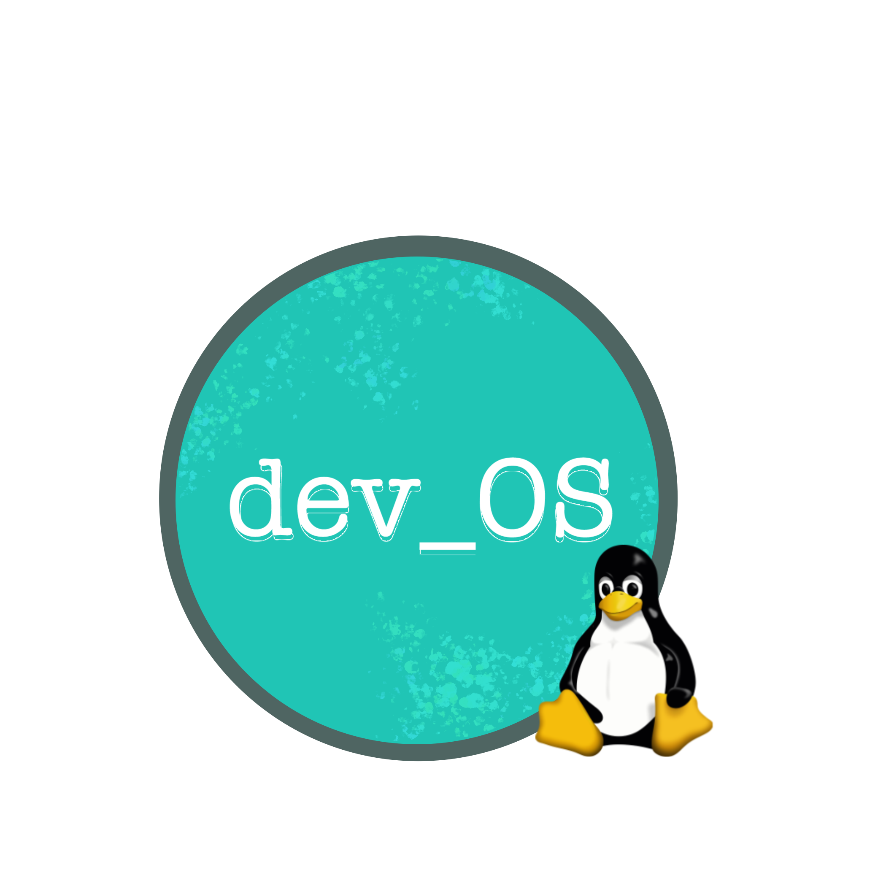

## Getting Started

`dev_OS` is a slim, sleek and smart Linux Operative System aimed for developers.

## Prerequisites

In order to build `dev_OS`, one would need Vagrant (v2.2) and VirtualBox (v6.1).

`dev_OS` is built inside a `Fedora 25` Virtual Machine.

## Deployment

After installing [Vagrant](https://vagrantup.com) and [VirtualBox](https://virtualbox.org),
one could build `dev_OS` by running:

```bash
vagrant plugin install vagrant-hostmanager vagrant-scp

# execute wget to download all build packages/files to bin/, using configs/packages_list.txt

bash vagrant_start.sh
```

## Post-requisites (optional)

Install [OpenJDK](https://openjdk.java.net/install/) v11 and [Jenkins](https://www.jenkins.io/doc/book/installing/linux/).
Once the installation is complete, please execute the following commands:

```bash
sudo usermod jenkins -aG %admin # admin: wheel (fedora/centos) or sudo (debian/ubuntu)
sudo mkdir -v /source
# perform a wget to download all build packages/files to /source, see docs/build_packages.txt
# create and run a pipeline
```

## Author

Lucio Afonso (Developer),
Aleksandra Afonso (Designer)

## License

This project is licensed under the GPL License - see the LICENSE file for details

## Acknowledgments

[buildyourownlinux](http://www.buildyourownlinux.com/)

[linuxfromscratch](https://www.linuxfromscratch.org/)
